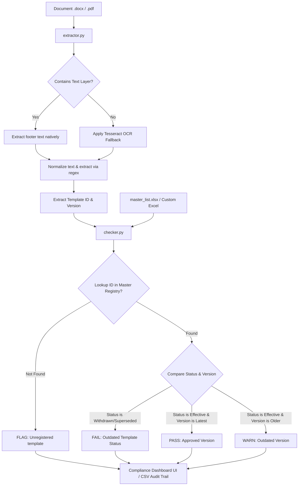
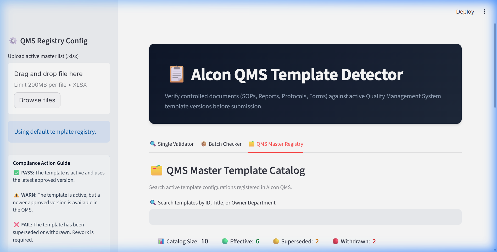
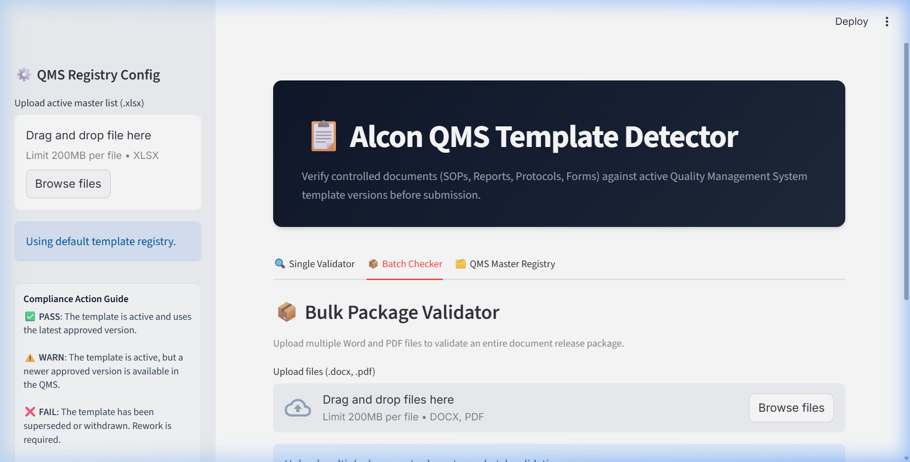

# 🔍 Alcon QMS Outdated Template Detector

An automated compliance dashboard that helps engineers automatically verify whether the Template ID and Version in their Word or PDF document footer matches the latest approved version in the Quality Management System (QMS) registry — before submitting for review.

---

## 🏗️ System Architecture



---

## 📸 Dashboard Preview

### 1. QMS Master Registry View
The master registry tab lets compliance officers search, filter, and inspect registered QMS templates. It features a space-efficient, theme-adaptive horizontal status bar showing catalog metrics.



### 2. Batch Validation Compliance Report
Engineers can drag-and-drop multiple documents at once to run package verification. The system displays a progress bar and outputs a color-coded horizontal results bar and an audit grid.



---

## 🛠️ Core Features

1. **Deterministic Verdict Logic**: To comply with regulated medical device standards (like Alcon's), the pass/fail verification path is 100% deterministic (regex extraction paired with database lookup). AI is not in the decision loop, ensuring complete predictability and auditability.
2. **Adaptive Light/Dark UI**: Custom CSS structures styled with Streamlit's native theme properties (`var(--text-color)`, `var(--border-color)`, `var(--background-color-secondary)`) ensure 100% legibility on both white and black browser themes.
3. **Robust Extraction (Layout Tables & Variations)**: Parsers are built to handle footers structured inside layout grids, lettered revisions (e.g. `Rev C`), and spelling variants (`Revision:`, `Rev.`, `Version:`).
4. **Resilient OCR Fallback**: If a document is a scanned image with no native text layer, the system falls back to Tesseract OCR to read the footer.
5. **Interactive Catalog & Custom Databases**: Users can upload a custom master spreadsheet via the sidebar. If the schema is malformed, a fallback handler automatically restores the default QMS register.

---

## 🗂️ Project Structure

| File / Folder | Purpose |
|---|---|
| `app.py` | Premium Streamlit dashboard containing the Single Validator, Batch Checker, and Catalog search UI. |
| `checker.py` | Contains database indexing and comparison rules (`PASS`, `WARN`, `FAIL`, `FLAG`). |
| `extractor.py` | Handles native word (`python-docx`), native PDF (`pdfplumber`), and scanned PDF (`pytesseract`) extraction. |
| `master_list.xlsx` | Default Excel QMS master registry. |
| `sample_docs/` | Collection of test documents representing all validation verdicts. |
| `tests/test_cases.py` | Automated test suite verifying 31 checks across edge cases, lookup logic, and integrity. |
| `assets/` | Folder containing screenshots embedded in documentation. |

---

## 🚀 Setup & Execution

### 1. Install Dependencies
Ensure you have Python 3.8+ installed, then install the required libraries:
```bash
pip install python-docx pdfplumber pandas openpyxl streamlit
```

### 2. Run the Test Suite
Before starting the server, run the automated validation suite to check logic integrity:
```bash
python tests/test_cases.py
```

### 3. Launch the Dashboard
Start the local Streamlit application:
```bash
streamlit run app.py
```
Open [http://localhost:8501](http://localhost:8501) in your browser.

---

## 📈 Verdict Rules Reference

| Verdict | Color Pill | Meaning / Action Required |
|:---:|:---:|---|
| **PASS** | 🟢 Green | The template is active (`Effective`) and matches the latest registered version. Document is ready for submission. |
| **WARN** | 🟡 Yellow | The template is active, but a newer version is registered in the QMS (e.g., footer is `v2.0` but registry indicates `v3.0`). Action: Update document template. |
| **FAIL** | 🔴 Red | The template is deprecated (`Superseded` or `Withdrawn`). Action: Replace with the newer replacement template listed. |
| **FLAG** | ⚪ Slate | The Template ID is missing, unreadable, or not present in the registry catalog. Action: Contact QA to register the template. |

---

## 🔮 Risks, Scale-Up & Production Readiness

### 1. Scaling to 1,000+ Documents/Day
- **Microservices Architecture**: Wrap the extraction and validation logic in a serverless REST API (e.g., FastAPI hosted on AWS Lambda or Azure Functions).
- **Asynchronous Processing**: Process incoming files via a background worker queue (e.g. Celery + Redis / RabbitMQ) to handle concurrent traffic spikes gracefully.
- **Repository Hooks**: Integrate directly as a git pre-commit hook or automated QA pipeline gate inside the document management system (e.g. Veeva Vault) to scan files automatically.

### 2. Risks & Mitigations
- **OCR Accuracy**: Low-resolution scans can misread template IDs (e.g. translating `0` to `O`). *Mitigation*: Integrate a fuzzy matching library (like `rapidfuzz`) to catch near-matches and suggest corrections.
- **Database Availability**: A down database blocks document verification. *Mitigation*: Implement local caching of the QMS master list in Redis, refreshed on a daily schedule, to guarantee sub-millisecond offline lookup resilience.
